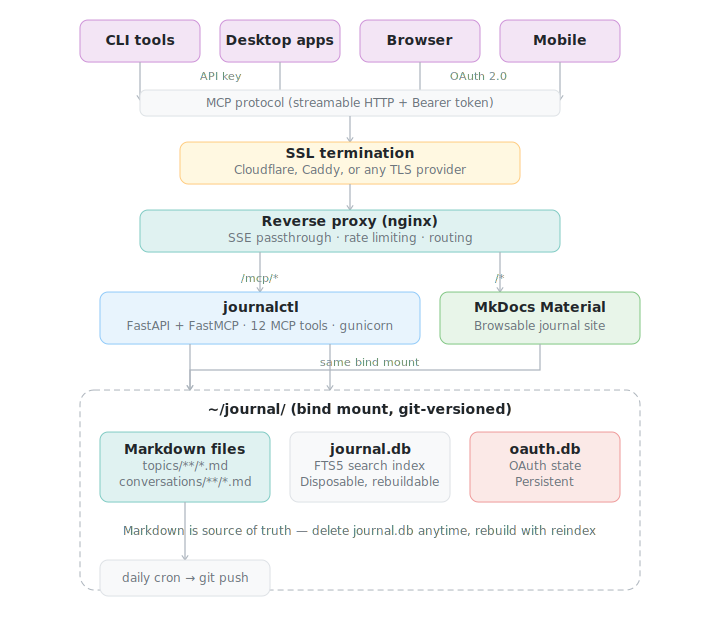
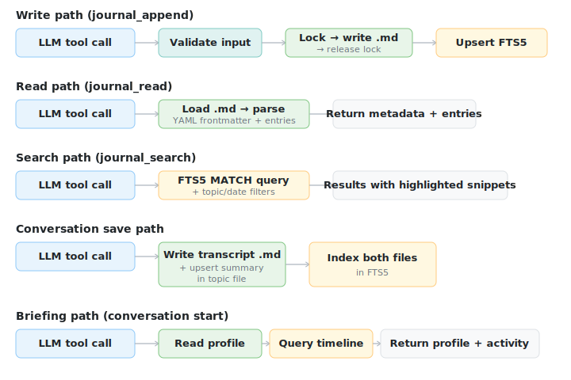
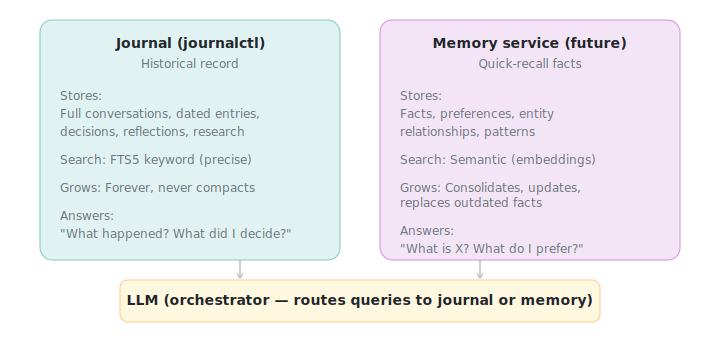

# Architecture

## System overview

journalctl is a FastAPI application that exposes 12 MCP tools over streamable HTTP. Any MCP-compatible client connects via the MCP protocol, authenticates using one of three configurable modes (static API key, self-host OAuth 2.1, or external OAuth via Hydra introspection), and reads/writes to a canonical PostgreSQL 17 database (`pgvector/pgvector:pg17`). Conversation transcripts are additionally archived as JSON files on disk for long-term backup.



## Three-tier data model

The journal stores data in three tiers, each serving a different purpose:


**Tier 1 -- Hot data** (entry.content, ~50-100 tokens). Headline/summary always loaded with briefings and timelines. Stored encrypted in the `entries` table.

**Tier 2 -- Warm data** (entry.reasoning, ~200-500 tokens). Reasoning and background context, loaded on-demand when reading a specific topic via `journal_read_topic`. Stored encrypted in the `entries` table alongside content.

**Tier 3 -- Cold data** (conversation JSON, 5k-100k tokens). Full chat transcripts archived as `conversations_json/{uuid}.json` files alongside the database. Messages are also stored (encrypted) in the `messages` table for in-database access. The JSON archives are the rebuildable source -- designed for off-host backup (e.g. object storage). The JSON files themselves are plaintext on the bind-mounted volume; filesystem-level encryption of that volume is the operator's concern.

## Storage architecture

### Canonical storage: PostgreSQL 17

All data lives in one PostgreSQL database. The schema is owned by alembic migrations under `journalctl/alembic/versions/`. Six tenant-relevant tables plus an audit log:

```sql
users            -- id UUID PK, email, timezone, created_at, deleted_at,
                 --  partial UNIQUE (email) WHERE deleted_at IS NULL

topics           -- id, path UNIQUE, title, description,
                 --  user_id, created_at, updated_at

conversations    -- id, topic_id, slug, source,
                 --  title_encrypted BYTEA, title_nonce BYTEA CHECK(=12),
                 --  summary_encrypted BYTEA, summary_nonce BYTEA CHECK(=12),
                 --  tags TEXT[], participants TEXT[], message_count, json_path,
                 --  user_id, created_at, updated_at,
                 --  search_vector tsvector,                       -- regular column, app-populated
                 --  UNIQUE (topic_id, slug)

entries          -- id, topic_id, date, conversation_id,
                 --  content_encrypted BYTEA, content_nonce BYTEA CHECK(=12),
                 --  reasoning_encrypted BYTEA, reasoning_nonce BYTEA CHECK(=12 OR NULL),
                 --  tags TEXT[], user_id,
                 --  created_at, updated_at, deleted_at, indexed_at,
                 --  search_vector tsvector                        -- regular column, app-populated

messages         -- id, conversation_id, role,
                 --  content_encrypted BYTEA, content_nonce BYTEA CHECK(=12),
                 --  user_id, timestamp, position,
                 --  search_vector tsvector

entry_embeddings -- entry_id PK FK CASCADE, embedding vector(384),
                 --  user_id, indexed_at

audit_log        -- id, ts, actor_type, actor_id, action,
                 --  target_type, target_id, reason, metadata jsonb,
                 --  ip, request_id    -- append-only; UPDATE/DELETE blocked by trigger
```

### Encryption at rest

Prose fields are encrypted client-side with AES-256-GCM before they ever reach the database. The encrypted columns are:

- `entries.content`, `entries.reasoning`
- `messages.content`
- `conversations.title`, `conversations.summary`

Each encrypted value is paired with a 12-byte nonce in a sibling column. The first byte of the nonce encodes the master-key version, so multiple master keys can coexist for rotation. `ContentCipher.encrypt` always uses the highest-numbered key; `decrypt` selects the right key by the nonce-byte.

Plaintext columns have been dropped (migrations 0008 for entries/messages, 0014 for conversations). The database only ever sees ciphertext + nonce -- not prose, not formatting, not exact word forms.

### Full-text search without plaintext

`search_vector` is a regular `tsvector` column (not `GENERATED`). The repo populates it inline at INSERT/UPDATE time with `to_tsvector('english', $N)` where `$N` is the ephemeral plaintext bound only to that single statement. PostgreSQL tokenizes the input and stores the resulting tsvector; the prose itself never lands in any column. A live DB read sees only tokenized stems like `'banan':4 'bread':5 'love':2` -- enough for ranking, not enough to reconstruct sentences.

### Row-level security and multi-tenancy

The five tenant tables (`topics`, `entries`, `conversations`, `messages`, `entry_embeddings`) carry a `user_id` column and `ENABLE ROW LEVEL SECURITY`. Two database roles are created by migration 0002:

- `journal_app` -- runtime role, no `BYPASSRLS`. The application pool connects as this role; every query is RLS-scoped.
- `journal_admin` -- privileged role, `BYPASSRLS`. Used by alembic migrations and the optional admin pool for cross-tenant maintenance.

Inside each request, the tool layer opens a connection via `core.db_context.user_scoped_connection(pool)` which begins a transaction and runs `SELECT set_config('app.current_user_id', $1, true)`. The RLS policies read `app.current_user_id` from the GUC, so the same connection bound to user X cannot see user Y's rows. The helper also raises `hnsw.ef_search` to 100 for that transaction so HNSW recall survives the post-index RLS filter.

### Other schema decisions

- `entry_embeddings` uses `ON DELETE CASCADE` from `entries`. Soft-deleting an entry also removes its embedding row in the same CTE.
- `pgvector` HNSW index tuned for multi-tenant scale (`m = 32`, `ef_construction = 128`).
- `tsvector` GIN index powers `websearch_to_tsquery`, which handles natural language + boolean operators without crashing on trailing punctuation.
- `tags` and `participants` are `TEXT[]` -- `= ANY(tags)` is enough for current queries.
- `UNIQUE (topic_id, slug)` on `conversations` enables `ON CONFLICT DO UPDATE` upsert for idempotent re-saves.
- All timestamps are `TIMESTAMPTZ` except `entries.date` (day-level `DATE` is sufficient for the human-facing journal date).
- Foreign keys use `ON DELETE RESTRICT` for topic/entry/conversation links and `ON DELETE CASCADE` for messages and embeddings (lifecycle tied to parent).

### Audit log

`audit_log` is an append-only table written via `journalctl.audit.record_audit(conn, actor_type, actor_id, action, ...)`. A DB-level trigger blocks UPDATE and DELETE on the table -- compensating entries are the only correction path. Used today for user provisioning + email-collision events; broader call-site coverage lands per feature.

### Archival storage: JSON files

JSON files exist as **readable archival copies** inside `conversations_json/{uuid}.json`. Every saved conversation writes a UUID-named JSON file **before** the database transaction. Failure modes are clean: a failed file write never opens a transaction, and a failed transaction leaves a harmless orphan UUID file that nothing references.

```json
{
  "meta": {
    "type": "conversation",
    "source": "claude",
    "title": "Half Marathon Training Plan",
    "topic": "hobbies/running",
    "tags": ["running", "training"],
    "created": "2026-02-10",
    "summary": "Designed a 12-week half marathon training plan...",
    "message_count": 12
  },
  "messages": [
    {
      "role": "user",
      "content": "I want to train for a half marathon in April. Can you help me plan?",
      "timestamp": "2026-02-10T14:30:00Z"
    },
    {
      "role": "assistant",
      "content": "Let's build a 12-week plan based on your current fitness level...",
      "timestamp": "2026-02-10T14:30:15Z"
    }
  ]
}
```

Saving a conversation is idempotent -- re-saving the same `(topic, slug)` updates the existing row in place via `ON CONFLICT DO UPDATE`.

## Data flow



### Write path (journal_append_entry)

Input is validated (path traversal prevention, topic/date format, freetext sanitization, XML tool-call rejection) -> `user_scoped_connection` opens a transaction and binds `app.current_user_id` -> `cipher.encrypt(content)` and `cipher.encrypt(reasoning)` produce `(ciphertext, nonce)` pairs -> a single CTE inserts the entry (encrypted columns, `search_vector` from `to_tsvector('english', $plaintext)` ephemeral bind, `user_id` from the GUC) and bumps `topics.updated_at` -> after commit, the ONNX embedding is generated via `asyncio.to_thread` (outside the DB connection) and upserted into `entry_embeddings` via pgvector, then `entries.indexed_at` is stamped.

### Read path (journal_read_topic)

The tool queries the `entries` table for the given topic (pre-filtered by `WHERE deleted_at IS NULL`), sorted by date -> optionally filters by `date_from`/`date_to` -> uses a window function (`COUNT(*) OVER()`) to return total and data rows in one query -> capped at 500 entries with offset pagination -> decrypts each row's content and reasoning -> returns structured objects with id, date, content, reasoning, tags.

### Update path (journal_update_entry)

Inside the user-scoped transaction the repo `SELECT ... FOR UPDATE`s the row, decrypts the existing content (needed both for `mode='append'` and to recompute `search_vector` from the new full plaintext), re-encrypts the result, UPDATEs the entry (clears `indexed_at`), and bumps `topics.updated_at`. After commit, the new embedding is generated outside the DB connection and upserted.

### Delete path (journal_delete_entry)

A single CTE soft-deletes the entry (sets `deleted_at`), deletes its row in `entry_embeddings`, and bumps `topics.updated_at` -- all in one round-trip. The entry is preserved in the database for audit but excluded from all reads and searches.

### Search path (journal_search)

The query embedding is generated via `asyncio.to_thread(embedding_service.encode, query)` **before** a DB connection is acquired, so the pool isn't pinned during inference -> `require_cipher` gates entry -> in one user-scoped connection, `search_repo.fts_search` runs `websearch_to_tsquery` over a UNION ALL of `entries` and `conversations` (single `conn.fetch`, negated `ts_rank` for ascending sort) returning IDs + rank only -- no `ts_headline` since the columns are encrypted -> `embedding_service.search_by_vector` runs pgvector cosine similarity, RLS-scoped, topic + date pre-filtered in SQL -> FTS and semantic results are merged by `source_key` deduplication -> per-hit hydration calls `entry_repo.get_text` (decrypts content) or `conv_repo.get_title_summary` (decrypts title + summary) and truncates each at a per-result character cap. If query encoding fails the tool transparently degrades to FTS-only.

### Conversation save path (journal_save_conversation)

Message count validated (max 1000) -> conversation JSON archived to `conversations_json/{uuid}.json` **first** (writes a fresh UUID file) -> a single user-scoped DB transaction runs the `ON CONFLICT DO UPDATE` upsert (encrypted title + summary), deletes + re-inserts encrypted messages if message count changed, and upserts a linked entry tagged `['conversation']` so the saved conversation shows up in `journal_read_topic` and the timeline. Failure modes are clean: if the file write fails, no transaction runs; if the transaction fails, the orphan UUID file is harmless.

### Briefing path (journal_briefing)

User profile is read from `knowledge/user-profile.md` -> a canned key-facts query embedding is pre-encoded outside the pool -> one user-scoped connection fetches this week's entries (most-recent-first, capped at 25), the top 20 recently-updated topics, topic count, entry stats, and semantic key-fact matches via `embedding_service.search_by_vector`. All prose is decrypted before return.

## Concurrency model

The server runs multiple gunicorn workers against a shared PostgreSQL database:

| Mechanism | What | Why |
|-----------|------|-----|
| Per-worker asyncpg pool | Each gunicorn worker creates its own pool in its lifespan | asyncpg pools cannot survive `os.fork()` -- no `--preload` flag in gunicorn |
| Two pools per worker | `pool` from `JOURNAL_DB_APP_URL` (RLS-enforced runtime); optional `admin_pool` from `JOURNAL_DB_ADMIN_URL` (BYPASSRLS) | Tenant work runs as `journal_app`; cross-tenant maintenance and JIT user provisioning use the admin pool |
| PostgreSQL MVCC | Native reader/writer concurrency | No WAL-mode quirks, no `busy_timeout` needed |
| `SET LOCAL app.current_user_id` | Per-transaction GUC binding | RLS policies read this; user X's connection cannot see user Y's rows |
| `pg_try_advisory_lock(...)` | Cross-worker reindex lock | Prevents two workers from running semantic reindex concurrently; reindex is a library function, not an MCP tool |
| ASGI middleware | Raw scope/receive/send passthrough | `BaseHTTPMiddleware` buffers responses, which breaks SSE streaming |
| `secrets.compare_digest` | Timing-safe token comparison | Prevents token-guessing via timing side channels |
| `statement_cache_size=0` | asyncpg setting | Required for pgbouncer transaction-pooling compatibility |

## Authentication

journalctl supports three mutually-exclusive deploy modes, selected at startup by which env vars are set. A pydantic model validator enforces mutual exclusion: `JOURNAL_HYDRA_ADMIN_URL` and `JOURNAL_PASSWORD_HASH` cannot coexist; `JOURNAL_API_KEY` + `JOURNAL_OPERATOR_EMAIL` are required unless Hydra is on.

| Mode | API key | Self-host OAuth | Hydra introspection | Operator email |
|------|---------|-----------------|---------------------|----------------|
| 1. API-key-only self-host | required | -- | -- | required |
| 2. Full self-host (with DCR OAuth) | required | enabled (set `JOURNAL_PASSWORD_HASH`) | -- | required |
| 3. Multi-tenant via external IdP | -- | -- | enabled (set `JOURNAL_HYDRA_ADMIN_URL`) | -- (the IdP `sub` is the user) |

`BearerAuthMiddleware` (ASGI, not `BaseHTTPMiddleware`) handles all three paths in a single dispatch:

```
Incoming request with Bearer token
    +-- Static API key match (Modes 1/2)?  -- secrets.compare_digest
    |       -> bind operator user_id, allow
    +-- Token introspects via Hydra (Mode 3)?
    |       -> JIT-provision users row if new sub, bind sub as user_id, allow
    +-- Self-host OAuth token (Mode 2)?
    |       -> bind operator user_id, allow
    +-- Else
            -> 401 with WWW-Authenticate including resource_metadata pointer
```

Modes 1 and 2 share the operator UUID. At startup, `scaffold_operator(admin_pool, JOURNAL_OPERATOR_EMAIL, timezone)` ensures a `users` row exists for the operator (idempotent ON CONFLICT). Static-API-key and self-host-OAuth requests bind that UUID for RLS and audit purposes.

Mode 3 instead resolves the user lazily: the first time a Hydra-introspected access token presents a `sub` not in `users`, the middleware looks up the email via Hydra's `/userinfo`, INSERTs a `users` row, and writes a `USER_CREATED` audit row -- all on the admin pool, before the request contextvar is bound. A small LRU cache keyed by `sub` short-circuits the lookup once provisioned. An email collision (different `sub` already owns the email) emits an `auth.email_collision` audit and returns 401.

The self-host OAuth implementation lives in `journalctl/oauth/` and uses the MCP SDK's `OAuthAuthorizationServerProvider` plumbing: PKCE, RFC 7591 Dynamic Client Registration, bcrypt password verification, CSRF-protected login form, token refresh. OAuth state (registered clients, auth codes, access + refresh tokens) lives in `oauth.db` (SQLite), deliberately separate from the PostgreSQL journal database so auth changes never touch user data.

Hydra and the Kratos identity stack are open-source projects that self-hosters can also adopt if they want a Mode 3-style deployment; the journalctl side is just an OAuth 2.1 introspection client.

## Semantic memory is internal

There is no separate "memory service" to orchestrate. Semantic search is just part of the journal: `journal_append_entry` auto-embeds the entry after commit, `journal_search` merges `tsvector` FTS with `pgvector` semantic results, and `journal_briefing` surfaces key life facts by running a canned semantic query against the same embeddings. No memory tools are exposed to the LLM -- it just calls `journal_search`, `journal_briefing`, and `journal_read_topic` and gets both keyword and meaning-based results.

The `EmbeddingService` (`storage/embedding_service.py`) is a thin ONNX wrapper: synchronous `encode()` for CPU-bound inference, async `store_by_vector` / `search_by_vector` for pgvector upsert/search. Tool code encodes via `asyncio.to_thread` before acquiring a DB connection so the pool is never pinned during inference. Reindex is a library function (`tools/admin._run_reindex`) used by future admin APIs -- it is not registered as an MCP tool, since the `tsvector` index is always current and only the embedding side is ever rebuilt.


