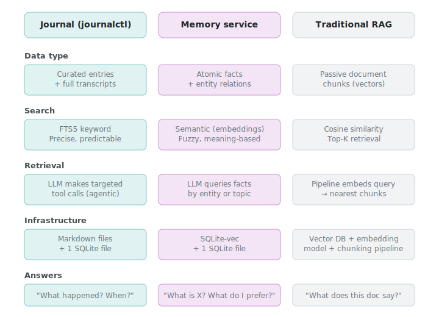

# Design Philosophy

## The problem

If you use LLMs as a daily companion for life decisions, project planning, hobbies, and work — your conversations vanish between sessions. Every new chat starts from zero.

Some LLMs offer built-in memory, but it's a black box: you don't control what's remembered, can't browse it, can't port it, and can't use it across different providers. Your context is locked inside one vendor's product.

journalctl is the escape hatch. It gives any MCP-compatible LLM persistent, structured memory that you own — stored in a SQLite database on your own server, with conversation transcripts archived as JSON files, and portable to any future client that supports MCP.

## Journal is a ledger, not a brain

The journal is an **append-only historical record**. It doesn't think, compress, forget, or consolidate. It faithfully stores everything you put in it.

This is a deliberate constraint. A ledger has three properties that matter:

1. **Complete history.** Nothing is lost. You can always go back and see exactly what you decided and why.
2. **Chronological structure.** Entries are dated. Time is the natural index for a human life — you remember things by when they happened.
3. **Durable and portable.** All data lives in SQLite on infrastructure you control. Conversation transcripts are archived as JSON files alongside the database. No external service, no vendor lock-in.

If the journal were a "brain" that consolidated and compressed, you'd lose the timeline, the nuance, and the ability to see how your thinking evolved. A brain is lossy. A ledger is not.

## Two services, not one

A journal alone can't answer every kind of question efficiently:

| Question | What's needed |
|----------|---------------|
| "When did I decide on that approach?" | Keyword search through history → **Journal** |
| "What's the current status of the project?" | Quick fact lookup → **Memory** |
| "Show me the conversation where I researched options" | Transcript retrieval → **Journal** |
| "What are my preferences for X?" | Entity/preference query → **Memory** |
| "What happened last week?" | Timeline view → **Journal** |

The journal answers **"what happened?"** — it's the historical record. A memory service answers **"what is?"** — it stores the current state of facts.

The LLM orchestrates between both — routing questions to the right service based on what's being asked. The two services are completely independent; there are no cross-service API calls.

## Why not RAG?

RAG (Retrieval-Augmented Generation) is the standard approach to giving LLMs access to external knowledge. It works by chunking documents into vectors, embedding them, and retrieving the nearest chunks at query time.

journalctl is **not** a RAG system, and doesn't need to be:

**RAG solves the wrong problem.** RAG is designed for large, passive document corpora where the LLM needs to "search and find" relevant context. Your journal isn't a corpus to be searched — it's a structured, curated record that the LLM actively writes to. The LLM knows where things are because it put them there.

**No chunking problem.** RAG's biggest headache is chunking: split too small and you lose context, too big and retrieval gets noisy. Journal entries are naturally chunked — each entry is a coherent unit written by a human or by the LLM, separated by date headers.

**No embedding drift.** Semantic similarity can be misleading. Two unrelated topics might score as semantically similar because they share abstract concepts. FTS5 keyword search is precise and predictable — you search for a specific term, you get results containing that term.

**Agentic retrieval beats statistical retrieval.** RAG retrieves the top-K nearest chunks and hopes the answer is in there. An LLM connected to journalctl makes *deliberate, targeted tool calls* — search for a keyword, then read a specific topic, then check a timeline — iteratively narrowing down exactly what it needs. The retrieval is driven by reasoning, not cosine similarity.

**No infrastructure overhead.** RAG requires an embedding model, a vector database, a chunking pipeline, and an ingestion process. journalctl needs one SQLite file.

The useful part of RAG — semantic search for fuzzy matching when you don't know the exact keywords — is handled by the integrated memory service. `journal_search` runs both FTS5 keyword search and semantic vector search in parallel, merging and deduplicating results. The memory service uses a local ONNX embedding model (no external API) to power the semantic half.

## Why markdown

- **Human-readable.** Open any file in a text editor and it makes sense immediately.
- **Git-friendly.** Every change produces a clean diff. You can see exactly what was added, when.
- **Tool-agnostic.** MkDocs, Obsidian, VS Code, `grep`, `cat` — anything that reads text files works.
- **No migration needed.** If you switch tools, the data is already in the most portable format possible.
- **LLM-native.** LLMs can read and write markdown naturally. No serialization layer.

## Why FTS5 over a vector database

FTS5 (Full-Text Search 5) is SQLite's built-in full-text search engine. It's the right choice for the journal because:

1. **Keyword precision.** When you search for a specific term, you want results containing that term — not semantically similar concepts. FTS5 gives exact matches.
2. **Zero infrastructure.** It's a single `.db` file. No separate service, no ports, no connection strings.
3. **Rebuildable.** The FTS5 virtual table inside `journal.db` can be dropped and rebuilt from the entries table at any time using `journal_reindex`. SQLite is the canonical store; the FTS5 virtual table is the search acceleration layer.
4. **Good enough.** For a personal journal with hundreds or even thousands of entries, FTS5 with snippet highlighting, date filtering, and prefix matching covers the vast majority of queries.

Semantic search (embeddings + vector similarity) is genuinely useful for questions where you don't know the exact keywords. `journal_search` handles this by running FTS5 and semantic search in parallel — the ONNX memory service provides the vector half, while FTS5 provides the precise keyword half.

## Why append-only

Entries are never deleted or modified in place (except through the explicit `journal_update_entry` tool). New information is appended. Old information stays.

This matters because:

- **Decisions have context.** A decision is only useful if you can also see *why* — which means the research, the alternatives considered, and the reasoning all need to persist.
- **Opinions change.** Your March assessment of something might differ from your June assessment. Both are valuable. An append-only log preserves the evolution.
- **Soft deletes preserve history.** Even when entries are deleted, they're marked as deleted in the database, not physically removed. SQLite backups preserve every version.

## Why self-hosted

- **You own every byte.** No third-party service has your journal data.
- **No usage limits.** Search as much as you want, store as much as you want.
- **LLM-portable.** When you switch LLM providers, point the new client at the same server.
- **Offline-capable.** The markdown files are on your server. SSH in and read them directly if needed.
- **Cost-predictable.** A small VM costs $5–15/month. No per-query pricing.

## Why LLM-agnostic

journalctl uses the [Model Context Protocol](https://modelcontextprotocol.io/) (MCP), an open standard for connecting LLMs to external tools. This means:

- Any MCP-compatible client can connect — CLI tools, desktop apps, browser-based chat, mobile apps.
- You're not locked into any specific LLM provider. Switch providers, keep your journal.
- Multiple clients can connect simultaneously — use one from your phone and another from your terminal.
- Authentication is standard (Bearer tokens or OAuth 2.0), not proprietary.

The journal doesn't know or care which LLM is calling it. It exposes tools, receives requests, and returns data. The intelligence stays in the LLM; the persistence stays in the journal.
